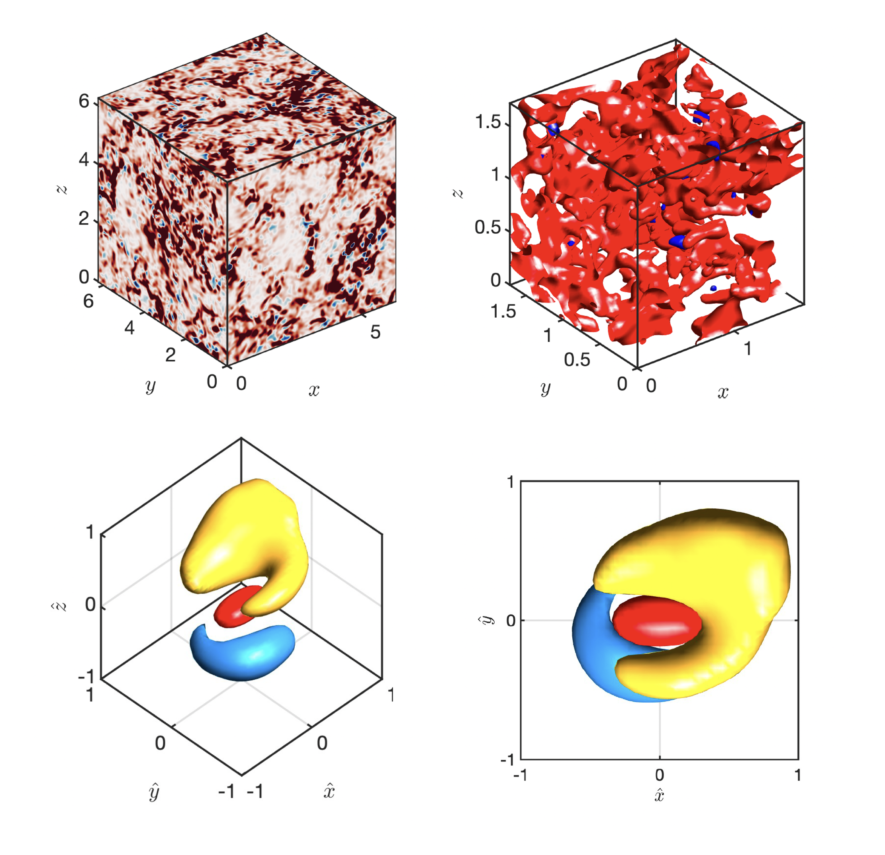

It has been long-researched how the energy cascade in turbulent flows, i.e. the transfer of kinetic energy from large to small flow scales or vice versa, works. Understanding this phenomenon is crucial and foundational in turbulence modeling. However, it is still not yet fully understood how the energy cascade and turbulent structures are formed. We are currently investigating the time-resolved coherent structure of the energy cascade in isotropic turbulence.