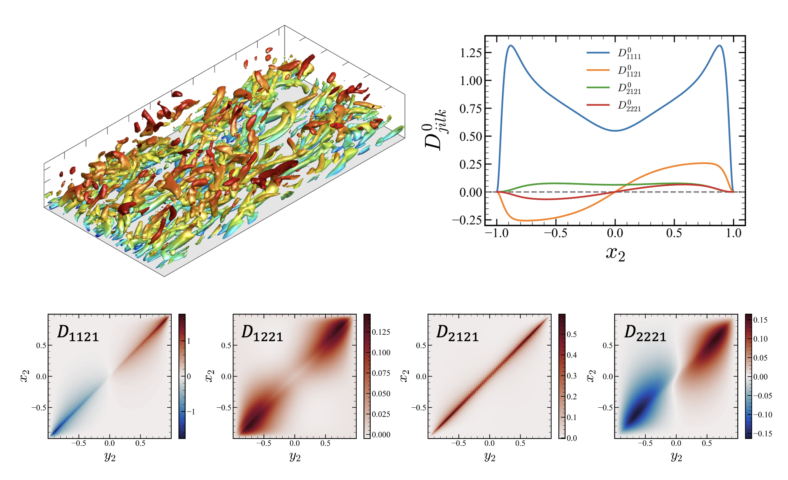

The Boussinesq approximation is often used in mainstream turbulence models but it has long been questioned, specifically for isotropy and locality of the eddy viscosity. To quantify these non-Boussinesq effects, we conducted a direct measurement of the eddy viscosity operator for a turbulent channel flow at Re&tau;=180 using the [macroscopic forcing method](/research/mfm), a systematic methodology that utilizes direct numerical simulations to determine turbulence closure operators. For the assessment of isotropy, we represent the eddy viscosity as a fourth-order tensor and provide all 81 components. The results indicate highly non-Boussinesq behavior: (1) eddy viscosity is significantly anisotropic, (2) Reynolds stresses can be generated by both the mean strain rate and the mean rotation rate, and (3) a locally truncated eddy viscosity operator generates asymmetric Reynolds stress tensor. Furthermore, to quantify the nonlocality of the eddy viscosity, we generalize the eddy viscosity operator in a fourth-order tensorial kernel form. We computed a subset of these tensorial kernels, specifically the ones associated with the streamwise velocity gradient with respect to the wall distance. The nonlocality analysis reveals that (1) eddy viscosity associated with parallel flows is indeed local, and (2) significant nonlocality is shown for other eddy viscosity components, suggesting turbulence models to include for more complex wall-bounded flows. In sum, our analyses provide the quantification of the eddy viscosity tensorial kernel in the turbulent channel flow and reveal why the Boussinesq approximation is valid for simple parallel flows but not for more complex wall-bounded flows.

After this research, we conducted MFM on [separated boundary layer](/research/sbl) to further understand the non-Boussniesq effects in more complex wall-bounded flows. 