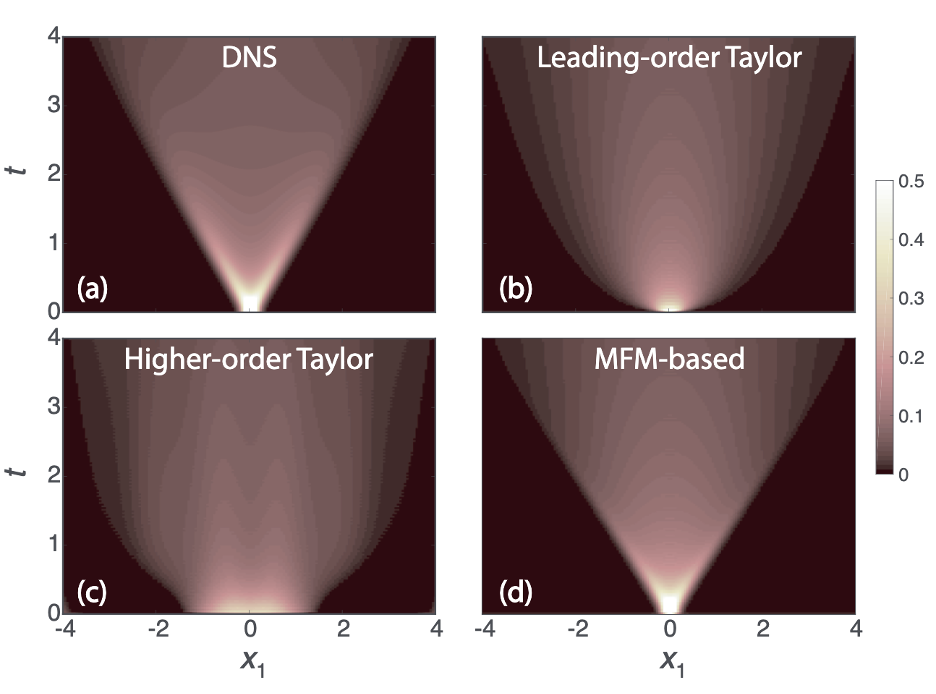

This research presents a numerical procedure, which we call the macroscopic forcing method (MFM), which reveals the differential operators acting upon the mean fields of quantities transported by underlying fluctuating flows. Specifically, MFM can precisely determine the eddy diffusivity operator, or more broadly said, it can reveal differential operators associated with turbulence closure for scalar and momentum transport. 

In our manuscript ([PRF](https://journals.aps.org/prfluids/abstract/10.1103/PhysRevFluids.6.054607?ft=1), [arXiv](https://arxiv.org/abs/1905.08342)), we present this methodology by considering canonical problems with increasing complexity. Starting from the well-known problem of dispersion of passive scalars by parallel flows we elucidate the basic steps in quantitative determination of the eddy viscosity operators using MFM. Utilizing the operator representation in Fourier space, we obtain a stand-alone compact analytical operator that can accurately capture the non-local mixing effects. Furthermore, a cost-effective generalization of MFM for analysis of non-homogeneous and wall-bounded flows is developed and is comprehensively discussed through a demonstrative example. Extension of MFM for analysis of momentum transport is theoretically constructed through the introduction of a generalized momentum transport equation. We show that closure operators obtained through MFM analysis of this equation provide the exact RANS solutions obtained through averaging of the Navier-Stokes equation. We introduce MFM as an effective tool for quantitative understanding of non-Boussinesq effects and assessment of model forms in turbulence closures, particularly, the effects associated with anisotropy and non-locality of macroscopic mixing.

After developing MFM, we have implemented the methodology to a [turbulent channel flow](/research/channel) and a [separated boundary layer](/research/sbl). We quantified missing pieces in the current turbulence models (e.g. non-Boussinesq effects) and we are currently developing a new turbulence model based on our MFM measurements. In addition, I have worked on MFM-inspired modeling for [NASA 2D wall-mounted hump](/research/wmh) as part of my internship at Boeing.