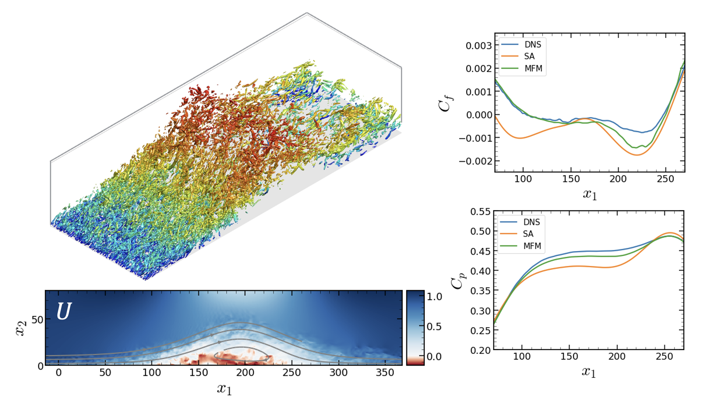

After the analysis on the eddy viscosity of the turbulence models in a [channel flow](/research/channel), we expanded our work to the more complex wall bounded flow of a separated boundary layer. This flow represents a phenomenon that is called smooth-body flow separation, which is very important in many fields including aeronautics and hydrodynamics. This smooth body flow separation is one of the most challenging aerodynamic phenomena to predict with the existing computational fluid dynamics (CFD) capabilities. Nevertheless, we need to capture these separation points because the inaccurate prediction of these points could lead serious errors in the load and momentum prediction of the vehicle. However, the problem is that the current CFD results are highly sensitive and therefore unreliable in the regions of separations. Thus, our goal is to develop a turbulent model with substantial accuracy improvement on flow systems with separation.

We conducted a direct measurement of the eddy viscosity for a canonical separated boundary layer flow at Re&theta;=350 using the [macroscopic forcing method](/research/mfm), a systematic methodology that utilizes direct numerical simulations to determine turbulence closure operators. By considering an asymptotic expansion utilizing spatial moments of the eddy-viscosity kernel, the Reynolds stress closure is precisely decomposed into local and non-local operators. This work presents the leading-order term in this expansion representing the local limit of the eddy diffusivity operator. All relevant tensor components of this operator are computed, and the results show substantial non-Boussinesq effects. The solution to the RANS equation augmented by the measured eddy viscosity tensor shows significant improvement compared to the prior RANS solutions to this flow. Here, we used Spalart-Allmaras (SA) model as the comparison and considered direct numerical simulation (DNS) as a ground truth. The persisting gap between this improved a priori RANS solution and the true mean field is quantified as a measure of upper bound on the accuracy of local Reynolds stress closures.

Currently, we are developing a stand-alone turbulence model to capture the physics in the smooth-body flow separation.
