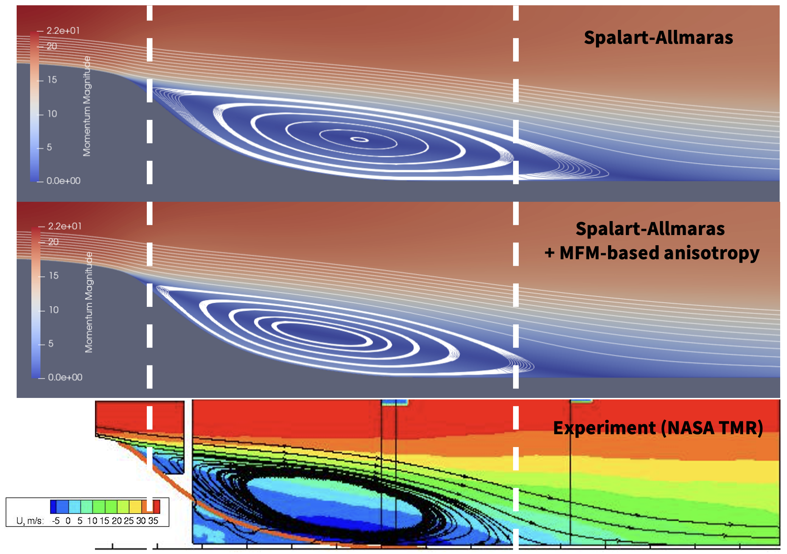

As part of the internship at Boeing, we conducted research on the MFM-inspired modeling attempt on a separated flow, specifically on the 2D NASA wall-mounted hump flow. This is a canonical flow system provided by the NASA Turbulence Modeling Resource, [TMR](https://turbmodels.larc.nasa.gov/nasahump_val.html). Using the leading-order moment of the eddy viscosity tensor [MFM](/research/mfm)-measured from the [turbulent channel flow](/research/channel), we developed an anisotropic ratio-model which utilizes the standard eddy viscosity derived from the Spalart-Allmaras model. We observed a significant sensitivity to the number of the eddy viscosity element added. In addition, we identified the eddy viscosity components that are more dominant in a spatially developing boundary layer using the asymptotics analysis. We saw improvements in the solution such as having a more accurate-sized separation bubble. However, the developed model did not achieve the level of accuracy that we seek. Since our modeling basis was grounded on the parallel flow, we saw the need to conduct MFM on the separated flow configuration which led us to the work conducted with the canonical [separated boundary layer](/research/sbl).
