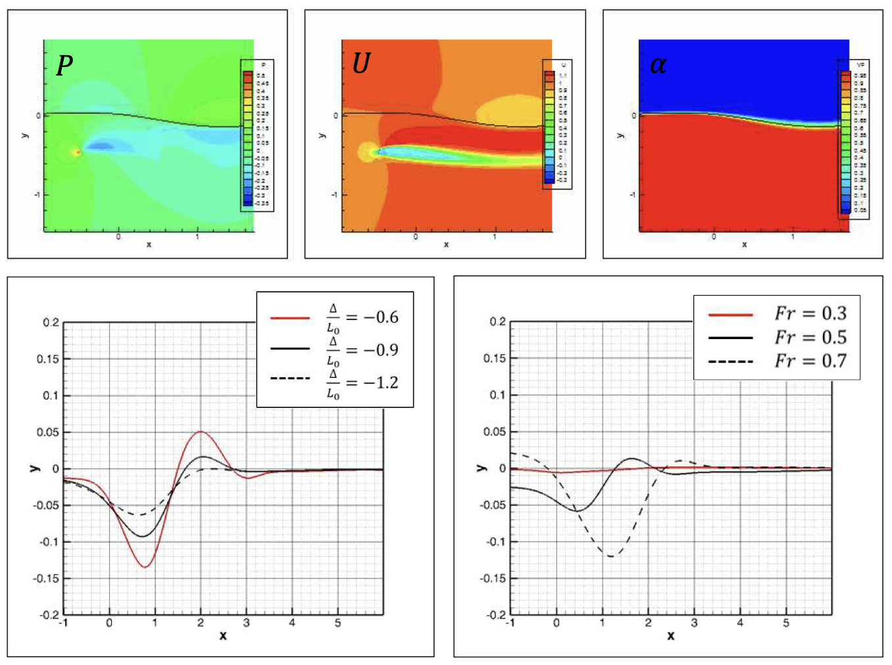

This work was conducted as part of my undergraduate thesis work at Seoul National University.

In shipbuilding and ocean engineering, most of the flow around ships and offshore structures is a two-phase flow, and the motion of an object is affected by the water surface. A fixed or floating body near the water surface interacts with the water to cause disturbance in the interface. To interpret these motions using computational fluid dynamics (CFD) the grid must change in response to the fluid force and induced motion at every moment. Therefore, using the immersed-boundary finite-volume method is beneficial in analyzing the motion of objects with complex geometry. Therefore, in this study, I implemented the volume of fluid (VoF) method to an immersed-boundary CFD solver. This implementation allows simulating flow systems with objects that move in time in the two-phase flow.

For the verification of implementation, we used a submerged hydrofoil below the water surface and analyzed the disturbance to the interface. Moreover, parametric studies of the hydrofoil flow were conducted using this VoF-implemented immersed-boundary solver.