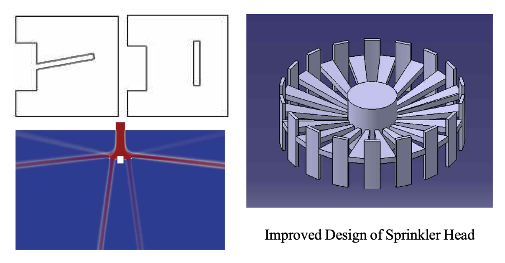

During my undergraduate studies, I wanted to utilize the computation fluid dynamics (CFD) technique in real-world application and help society by providing safer sprinklers for a fire hazard. This work won the Excellent Research Award from the Ministry of Science & ICT, Korea in 2015.

Sprinkler equipment is the most used equipment for early fire suppression, and active research is being conducted recently in that it can suppress the initial fire quickly and effectively. The sprinkler head is composed of an orifice, a thermal element, a frame, and a deflector. When the fire is detected, the pressurized water is deflected on the lower end of the frame and the deflector and is sprayed in all directions. According to the shape of the sprinkler head, the distribution of water for fire extinguishing is different, and as a result, the range of spraying on the floor becomes non-uniform.

It is most effective that the pressurized water of the sprinkler is sprayed directly to the ignition point. However, since the location of the sprinkler head is fixed, the location of the ignition point cannot be specified. In order to increase the fire extinguishing efficiency, the spraying range should be the widest. Therefore, in this study, the spraying angle was quantitatively analyzed by changing the shape of the frame and deflector of the sprinkler head, and a new design was proposed with an expanded spraying range.